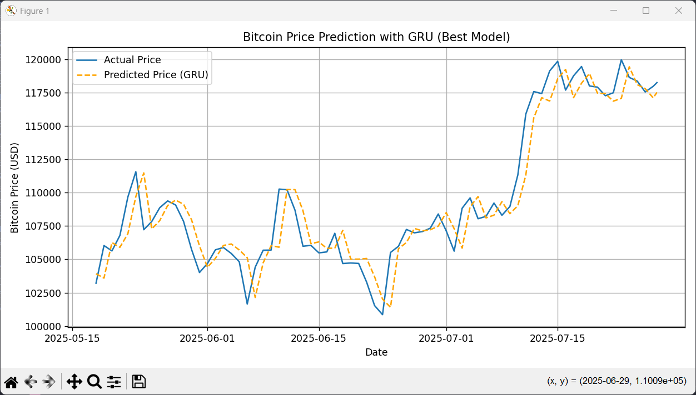
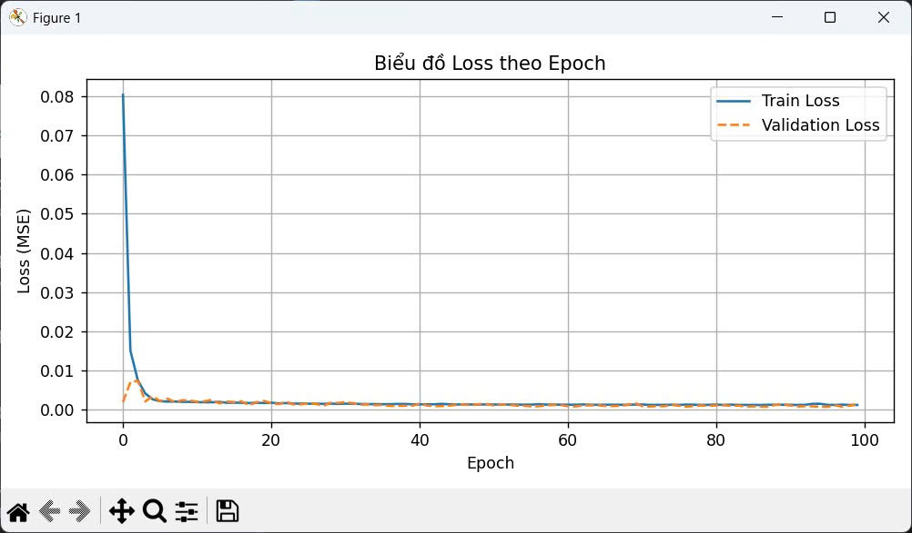

# 📈 Bitcoin Price Prediction with GRU & Streamlit

This project uses a Recurrent Neural Network (GRU) to predict the **next-day Bitcoin price** based on historical data from [CoinGecko](https://www.coingecko.com/).  
It also includes a simple web app built with **Streamlit** to make predictions and visualize trends.

---

## 🚀 Features

- Real-time data fetching from CoinGecko API
- Preprocessing and sequence creation for time-series prediction
- GRU-based model trained and saved with TensorFlow/Keras
- Visualization and prediction using Streamlit

---

## 🛠️ Tech Stack

- Python 3.x
- TensorFlow / Keras
- scikit-learn
- Streamlit
- CoinGecko API
- Matplotlib, NumPy, Pandas

---
## 📊 Model Performance

After training on 365 days of Bitcoin data:

| Metric        | Value   |
|---------------|---------|
| **R² Score**  | 0.9009  |
| **MAE**       | 1288.85 |
| **RMSE**      | 1700.54 |

### 📈 Visualization:

---
### Demo
[Demo](https://bitcoin-price-forecasting-gru-dl-s4bnv4ktidpbcqnrlniskg.streamlit.app/)
---

📬 Contact
Nguyễn Võ Đăng Khoa
📧 [dangkhoa18205@gmail.com](mailto:dangkhoa18205@gmail.com)
🔗 [LinkedIn Profile](https://www.linkedin.com/in/%C4%91%C4%83ng-khoa-nguy%E1%BB%85n-v%C3%B5-9067aa36a/)
